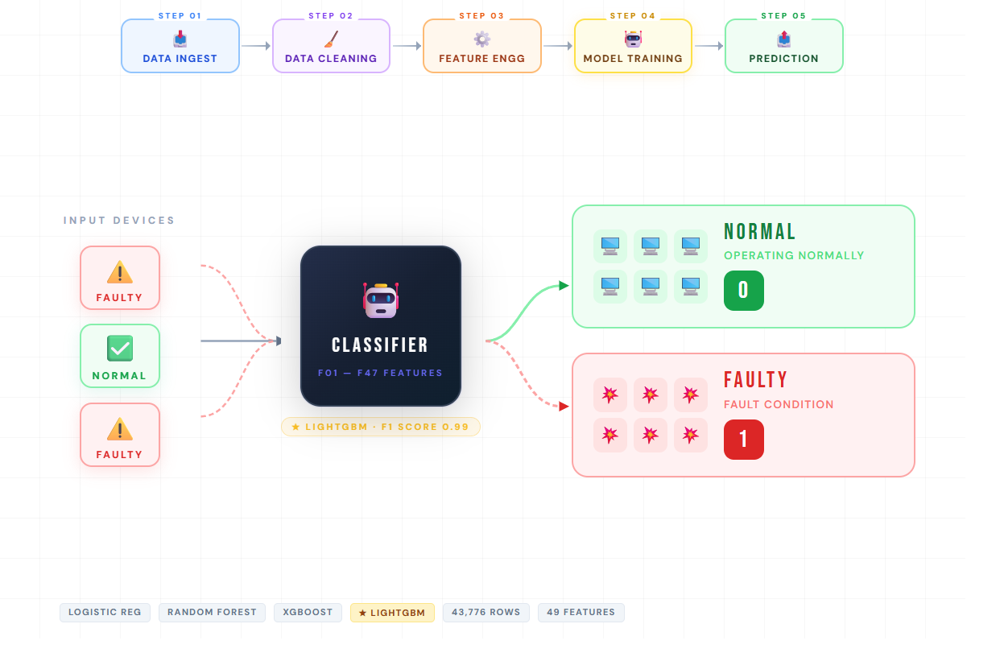

# Binary Classification — Feature Engineering & Model Benchmarking

A complete walkthrough of data cleaning, feature engineering, and model evaluation  
on a **43,776-row × 47-feature** binary classification dataset.


<p align="center">
  
</p>

---

## 🔄 Workflow Overview

<p align="center">
  
</p>
---

## 📁 Project Structure

```
├── Raw Data ├── TRAIN.csv
|            ├── TEST.csv
|
├──Algo used ├── Logistic_reg.ipynb
|            ├── Random_f.ipynb
|            ├── LightGBM_f.ipynb    
|            ├── Xgboost_f.ipynb
|
├── Feature Engineering ├──  Feature_Engg.ipynb
|                       ├──  TEST_FE.csv
|                       ├──  TRAIN_FE.csv
|
├── Final Model ├──  Train.ipynb
|
├── FINAL.csv  
|       
└── README.md
```

---

## 📊 Dataset Overview

| Property | Value |
|----------|-------|
| Rows | 43,776 |
| Raw Features | 47 (F01–F47) |
| Target | `Class` (0 or 1) |
| Class 0 | 26,465 (60.5%) |
| Class 1 | 17,311 (39.5%) |
| Missing Values | None |
| Data Types | All float64 |

---

## 🧹 Data Cleaning

### 1. Near-Zero Variance Feature Removed

`F20` had a standard deviation of **0.000179** — essentially constant across all rows.  
Features with near-zero variance carry no signal and were dropped.

```python
df.drop(columns=['F20'], inplace=True)
```

### 2. No Missing Values

The dataset was clean — no imputation was required.

### 3. No Duplicate Rows

All 43,776 rows were unique.

---

## ⚙️ Feature Engineering

Features were grouped by their magnitude and value range into 5 natural groups:

| Group | Features | Range | Characteristic |
|-------|----------|-------|----------------|
| A | F01–F09 | 0–5 | Small positive amplitudes |
| B | F10–F19 | 0–50 | Moderate values |
| C | F21–F29 | 0–15 | Same signal as A at larger scale |
| D | F30–F38 | 0–1257 | Same signal as B at ~0.8× scale |
| E | F39–F47 | −26 to +28 | Signed delta features |

---

### Step 1 — Replace Group C with C/A Ratio Features

**Finding:** Group A and Group C measure the **same physical signal at different scales**.  
Correlation between paired features reached up to **0.997** — nearly identical.

| Pair | Correlation | Scale Factor |
|------|------------|-------------|
| F01 vs F21 | 0.770 | 2.93× |
| F06 vs F26 | 0.996 | 4.58× |
| F07 vs F27 | 0.997 | 2.22× |
| F09 vs F29 | 0.990 | 0.55× |

**Action:** Dropped Group C (9 features), added 9 C/A ratio features.  
The ratio captures *how much C amplifies A* — which differs between classes.

```python
for fa, fc in zip(grpA, grpC):
    df[f'ratio_{fc}_{fa}'] = df[fc] / (df[fa] + 1e-9)

df.drop(columns=grpC, inplace=True)
```

---

### Step 2 — Replace Group D with D/B Ratio Features

**Finding:** Group D follows a near-constant **~0.80×** scale of Group B.  
But this ratio **breaks** for Class 1 — particularly `F31/F11`:

| Pair | Class 0 Ratio | Class 1 Ratio | Difference |
|------|--------------|--------------|------------|
| F30/F10 | 0.801 | 0.790 | 0.011 |
| F31/F11 | **1.498** | **2.687** | **1.190** ← Key |
| F32/F12 | 1.070 | 1.203 | 0.132 |
| F36/F16 | 0.791 | 0.807 | 0.016 |

**Action:** Dropped Group D (9 features), added 9 D/B ratio features.

```python
for fb, fd in zip(grpB, grpD):
    df[f'ratio_{fd}_{fb}'] = df[fd] / (df[fb].abs() + 1e-9)

df.drop(columns=grpD, inplace=True)
```

---

### Step 3 — F19 Residual Feature

**Finding:** F19 has a **0.84 correlation** with the sum of Group A (F01–F09).  
The residual — the part of F19 *not* explained by Group A — is a new independent signal.

```python
sumA  = df[grpA].sum(axis=1)
slope = np.cov(sumA, df['F19'])[0,1] / np.var(sumA)
df['F19_residual'] = df['F19'] - slope * sumA
```

---

### Step 4 — Group Sum Aggregations

Two group-level aggregations with strong discriminative power:

```python
df['grpA_sum'] = df[grpA].sum(axis=1)   # total energy in Group A
df['grpB_sum'] = df[grpB].sum(axis=1)   # total energy in Group B
```

| Feature | Class 0 Median | Class 1 Median | Ratio |
|---------|---------------|---------------|-------|
| grpA_sum | 0.475 | 1.266 | 2.67× |
| grpB_sum | 28.4 | 33.1 | 1.17× |

---

### Feature Count Summary

| Step | Action | Feature Count |
|------|--------|--------------|
| Start | Raw dataset | 47 |
| Drop F20 | Remove noise feature | 46 |
| Replace C → C/A ratios | −9 +9 | 46 |
| Replace D → D/B ratios | −9 +9 | 46 |
| Add F19 residual | +1 | 47 |
| Add grpA_sum + grpB_sum | +2 | **49** |

---

## 🤖 Model Results

> AUC = ROC-AUC score, F1 = Macro F1.

### Before Feature Engineering — Raw 47 Features

| Model | Accuracy | AUC | F1 (Macro) |
|-------|----------|-----|------------|
| Logistic Regression | 60%  | 0.57 | 0.57 |
| Random Forest | 96% | 0.9963 | 0.96 |
| XGBoost | 97% | 0.9966 | 0.97 |
| LightGBM | 98% | 0.9967 | 0.97|


---

### After Feature Engineering + Hyperparameter Tuning

| Model | Accuracy | AUC | F1 (Macro) | Best Params |
|-------|----------|-----|------------|-------------|
| Logistic Regression | 61% | 0.58 | 0.58 | C=100 |
| Random Forest | 96% | 0.9964 | 0.96 | n_estimators=200, max_depth=20 |
| XGBoost | 98% | 0.9978 | 0.98 | lr=0.05, max_depth=8, n_est=800 |
| LightGBM | 98% | 0.9985 | 0.99 | lr=0.05, num_leaves=127, n_est=600|

---


## 🛠️ How to Reproduce

```bash
# 1. Clone the repo
git clone https://github.com/Ayush-Bisht001
cd Ml-Arina-Challenge

# 2. Install dependencies
pip install pandas numpy scikit-learn xgboost lightgbm scipy matplotlib seaborn

# 3. Run feature engineering
jupyter notebook feature_engg.ipynb


# 4. Train your models on TRAIN_FE.csv
```

---

## 📦 Dependencies

```
pandas
numpy
scikit-learn
xgboost
lightgbm
scipy
matplotlib
seaborn
jupyter
```

---

## 📝 Notes

- All ratio features use `+ 1e-9` in the denominator to prevent division by zero
- `eval_metric='aucpr'` is recommended for XGBoost on this dataset (imbalanced classes)
- For F1 as XGBoost eval metric, use a custom function — `'f1_score'` is not a built-in XGBoost metric
